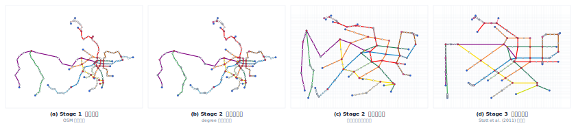
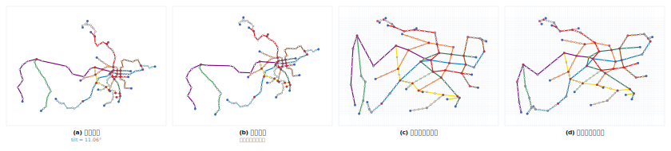
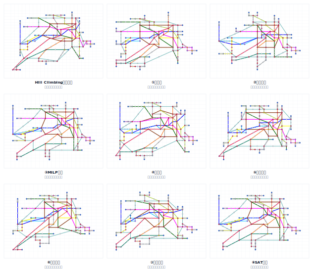
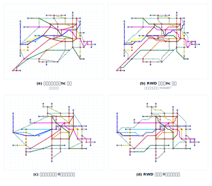
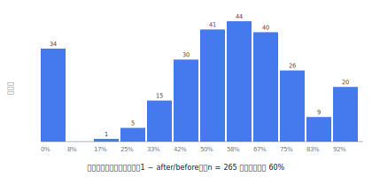

# 自適應版面的地理空間網絡資料視覺化

**Adaptive Layout Display Method for Geospatial Network Data**

鄭凱文（Kai-Wen Cheng）
指導教授：溫在弘 博士
國立臺灣大學理學院地理環境資源學系

> 博士論文文稿（草稿）・引用格式：APA 第 7 版・2026 年 7 月
> 本文稿整合博士論文計畫書（無 AI 版）、國科會計畫書（含 AI 版）與 Adapt-Metro 系統之實作成果撰寫而成。

---

## 目次

- [中文摘要](#中文摘要)
- [Abstract](#abstract)
- [第一章　緒論](#第一章緒論)
- [第二章　文獻回顧](#第二章文獻回顧)
- [第三章　研究方法](#第三章研究方法)
- [第四章　系統實作](#第四章系統實作)
- [第五章　實驗與評估](#第五章實驗與評估)
- [第六章　討論](#第六章討論)
- [第七章　結論與未來工作](#第七章結論與未來工作)
- [聲明](#聲明)
- [參考文獻](#參考文獻)

---

## 中文摘要

在資料視覺化領域中，隨著地理網絡數據的日益增加與複雜化，以及各種尺寸顯示裝置的普及，開發能夠適應不同版面的地理網絡數據視覺化技術變得日趨重要。本論文提出一個自適應版面的地理空間網絡資料視覺化演算法框架，使複雜的空間網絡數據能以路網圖（示意圖）的形式合理展示於各種尺寸的顯示介面上，並可依屬性資料動態縮放重要區域。方法上，本研究以網格作為基本運算單位，建構「真實路網輸入 → 拓撲骨架化與整數格網化 → 多準則爬山最佳化與三步鏈循環壓縮 → 嚴格方向約束之響應式畫線」四階段管線；其中將八篇路網圖自動繪製經典文獻各自實作為可並列比較的「直線鏈」，並提出以「端點移動、直線縮減、網格合併」三種各守嚴格單調不變式之移動所構成的 movewise 循環壓縮機構。針對生成式 AI 的應用，本研究提出「提案歸模型、合法性歸規則」的 LLM-in-the-loop 架構：大型語言模型負責提出佈局調整、欄列權重與評價，所有提案均經確定性硬規則驗證後才落地；架構與特定模型無關——正確性下界由純演算法構造性保證，模型演進僅單調提升提案品質，研究主張不隨模型換代貶值。系統以全球 234 個城市地鐵系統、12 國國家鐵路與 3 個都會區高速公路網進行全量驗證：三步鏈循環於全部案例收斂（總計約 5 秒）、直角爬山鏈使全網水平垂直線段提升 42.9%、響應式畫線於全部案例維持零交叉。本論文貢獻在於：（1）通用且確定性的自適應路網圖演算法框架；（2）針對 NP-hard 正交壓縮問題之可逐步檢視的局部搜尋解法；（3）生成式 AI 繪製流動網絡圖之第一個方法架構；（4）全球尺度示意圖佈局基準——234 城統一資料集與八演算法同約束基準結果。

**關鍵字**：資料視覺化、地理視覺化、地鐵路線圖、路網圖、示意圖、地圖概括化、自適應設計、響應式設計、大型語言模型

---

## Abstract

The growing volume and complexity of geospatial network data, together with the proliferation of display devices of every size, call for visualization techniques that adapt network maps to arbitrary layouts. This dissertation presents an adaptive layout framework for geospatial network data visualization that renders complex spatial networks as schematic maps on displays of any dimension, while dynamically enlarging regions of high attribute importance. The method uses a grid as its basic computational unit and organizes the process into a four-stage pipeline: real-network input, topological skeletonization with integer gridding, multicriteria hill-climbing refinement with a three-step movewise compaction loop, and responsive drawing under strict direction constraints. Eight classical schematic-drawing algorithms are each implemented as comparable "straightening chains," and a novel movewise loop—endpoint moves, line compaction, and grid merging, each guarded by a strictly monotone invariant—compacts the layout to minimal size. For generative AI, the dissertation proposes an LLM-in-the-loop architecture in which the language model proposes layout moves, column/row weights, and critiques, while deterministic hard rules retain sole authority over legality. The architecture is model-agnostic by construction: the purely algorithmic pipeline guarantees a correctness lower bound independent of any model, and model progress can only improve proposal quality monotonically, so the contributions do not depreciate as language models evolve. The framework is validated at scale on 234 metro systems worldwide, national railways of 12 countries, and 3 metropolitan highway networks: the movewise loop converges on every instance (about five seconds in total), the rectilinear hill-climbing chain increases horizontal/vertical segments by 42.9% network-wide, and responsive drawing preserves zero crossings throughout. The contributions are: (1) a general, deterministic framework for adaptive schematic network maps; (2) a stepwise-inspectable local-search treatment of an NP-hard orthogonal compaction problem; (3) the first methodological architecture for drawing flow network maps with generative AI; and (4) a global-scale benchmark for schematic map layout—a unified 234-city dataset with baseline results of eight classical algorithms under identical constraints.

**Keywords**: data visualization, geovisualization, metro map, schematic map, map generalization, adaptive design, responsive design, large language models

---

## 第一章　緒論

### 1.1　研究背景與動機

流動網絡圖是資料視覺化中應用廣泛的表示方法，由節點與節點間的連結構成，能多樣化呈現具有網絡連線關係的資料內容（Nobre et al., 2019）。當網絡資料進一步與地理空間資訊結合，便能展示不同地點之間的空間互動關係。隨著行動裝置與物聯網技術普及，城市運營數據的資料量日益龐大，這些數據多可視為包含空間資訊的中大型網絡資料；如何開發有效的視覺化系統使其易於被使用者理解，對智慧城市治理相當重要，近年文獻亦多致力於開發展示城市空間網絡動態數據的視覺化系統（Deng et al., 2023; Feng et al., 2022; Zhang et al., 2020）。然而這些系統往往針對特定數據與特定使用目的而設計，缺乏統一的標準；網絡視覺化的研究論文雖多，提供開放使用的函式庫卻相對稀少（Nobre et al., 2019），使流動網絡資料視覺化的實作難以擴充（Schöttler et al., 2021）。

早在 Weiser（1991）提出普適運算（ubiquitous computing）的構想時，「運算無所不在」便意味著「視覺化需求無所不在」。數位看板、智慧型手機、穿戴裝置陸續普及之後，這個推論已成為日常：大量的網路資訊透過行動裝置提供給使用者，而行動裝置的市佔率已超過桌上型電腦（Rathore & Singhal, 2024）。網絡資料經過視覺化後必須能在各種尺寸的顯示平台上合理呈現；單純的線性縮放會讓網絡圖的整體趨勢難以理解，公共運輸情境下的資訊呈現尤其如此（Craig & Liu, 2019）。如何在不同平台上自由且精確地展示空間網絡數據，遂成為資料視覺化的重要議題。

空間網絡簡化最為人熟知的形式是地鐵路線圖——本論文統一稱之為**示意圖**（schematic map；文獻亦稱路網圖、網絡圖或拓撲地圖，本文引用他人工作時保留其原詞）。其源頭可追溯至 Harry Beck 於 1933 年繪製的倫敦地鐵圖：以水平、垂直及 45 度線條取代依實際地理位置繪製的複雜曲線，明確以圖示描繪車站等重要資訊並去除非必要細節，使讀者能輕易識別車站位置並快速查詢路線。這類拓撲地圖（topological map）後來成為全球各大城市繪製交通路線圖的設計標準。然而現今的官方路線圖大多仍為人工繪製、風格互異；繪製脈絡雖有跡可循（路線簡化、放大擁擠區域、車站間距一致等），但繪製方式並未統一，使用者面對每一張新的路線圖都需重新學習閱讀方式。Cerović（2016）據此提出地鐵路線圖標準化的概念，定義出一組可套用於任何城市的基本元件；若將此概念延伸到結合屬性資料的網絡圖，應可有效降低使用者閱讀網絡視覺化圖表的學習成本。

把流量等屬性資料疊加到路網圖上，是本研究關注的第三條動機線。路網圖同時具備「圖表」的抽象表達與「地圖」的空間結構（Cartwright, 2015），適合承載主題性的網絡屬性；但要在有限版面中同時呈現網絡結構與屬性強度，勢必要「重要的放大、次要的簡化」。這正是地圖概括化（generalization）的課題——而以路網圖為對象、以連結屬性為依據的概括化與縮放，在文獻中幾乎沒有被處理（詳見第二章）。

最後，生成式人工智慧的快速發展為上述問題提供了新的可能。AI 代理（AI agent）與檢索增強生成（retrieval-augmented generation, RAG）技術能擴充大型語言模型（large language model, LLM）的能力，使其不僅回答設定範圍內的問題，還能自動處理複雜任務並依環境變化調整（Hassan, 2024）。若使用者能以自然語言下達「顯示擁擠路段」之類的指令，系統即自動分析數據並生成突顯結果，資料視覺化的彈性與使用者經驗都將大幅提升。然而現有結合 LLM 的視覺化研究止步於長條圖、圓餅圖等統計圖表；用 LLM 繪製或調整流動網絡圖，尚無方法架構可循。

### 1.2　研究目的

本研究的目的在於開發能夠適應不同大小或形狀版面的通用資料視覺化演算法框架。該框架整合路網圖自動繪製與地圖屬性概括化技術，使加入流量屬性資料的網絡圖能自適應顯示於不同裝置：依顯示版面的尺寸進行網絡圖屬性概括化，在不更改空間結構的情況下將其合理顯示於版面上，同時突顯關鍵資訊、簡化次要內容。框架並須為生成式 AI 預留介入位置，使 LLM 得以在確定性規則的把關下參與佈局的調整與評價。

### 1.3　研究問題

本論文回答三個研究問題：

**RQ1（演算法）**　如何發展一個通用演算法框架，使其能依據不同的顯示版面大小自動生成含有流量屬性資料的交通網絡圖，同時合理地突出重要內容並簡化次要資訊，且易於透過參數調整顯示結果、具備擴充性？

**RQ2（使用者）**　使用者在查看交通網絡圖時，是否容易識別因版面大小變化而調整的內容，並理解圖表內的位置對應到真實世界的何處？

**RQ3（人工智慧）**　如何引入大型語言模型並結合 AI Agent 與 RAG 機制，透過自然語言指定繪製需求，自動調整交通網絡圖的展示，使其依裝置尺寸和屬性內容動態優化？

RQ1 由第三章的四階段管線與 movewise 三步鏈回答；RQ2 由第五章的使用者評估設計回答；RQ3 由第三章第七節的 LLM 離線整合架構回答。

### 1.4　研究範圍與限制

本論文專注於路網圖的自動佈局（layout）與自適應繪製，暫不處理車站標籤繪製（labelling）、路線佈線（wiring）、線段方向性等相鄰課題；使用者互動僅涵蓋佈局層級（版面切換、權重調整、魚眼縮放與自然語言指令），不含地圖編輯。屬性資料以路線流量為代表案例；AI 路線採「模型提案、規則把關」的架構，不採端到端的深度學習生成——此選擇同時是方法立場：使研究主張不繫於任何特定模型的能力快照、不隨模型換代貶值（論證見 3.7.2 節）。網絡資料以 OpenStreetMap 為單一來源，其涵蓋品質構成資料面的先天限制，本研究以逐城驗證與人工裁決機制降低其影響（見 3.3 節與 4.2 節）。

### 1.5　論文架構

第二章回顧路網圖自動繪製、響應式與自適應資料視覺化、地圖概括化、以及生成式 AI 視覺化四條文獻脈絡，並指出研究空缺。第三章提出研究方法：以網格為計算單位的四階段管線，含各階段演算法的形式化描述與 LLM 離線整合架構。第四章說明 Adapt-Metro 系統的實作，包括三條資料管線、前端架構、效能與可重現性設計。第五章報告系統級全量實驗結果並提出使用者評估設計。第六章討論方法定位、取捨與限制。第七章總結貢獻並展望未來工作。

---

## 第二章　文獻回顧

本研究內容為可自適應版面的交通網絡圖流量屬性概括化，並使用 LLM 技術輔助網絡圖繪製。以下依序回顧四條文獻脈絡：（1）路網圖設計與自動繪製；（2）響應式與自適應資料視覺化；（3）地圖概括化；（4）生成式 AI 與資料視覺化。各節末歸納該脈絡與本研究的關聯，2.6 節檢視最接近本研究的近期工作並劃定區隔，2.7 節總結研究空缺。

### 2.1　路網圖設計

自 Beck 的倫敦地鐵圖以來，「使用直線、簡化角度、減少轉角」的繪製理念成為全球交通網絡圖的基本遵循；數十年的演變使路網圖風格依交通網絡複雜度、應用需求與設計風格而高度多樣化，多篇研究對這些樣式進行了歸納與分類（Nickel & Nöllenburg, 2020; Nobre et al., 2019; Roberts, 2014; Wu et al., 2020, 2022）。Roberts（2014）指出，有效的示意圖設計並無單一理論，設計準則之間存在張力；Wu 等人（2020）的調查則從設計、機器與人類三個視角整理轉乘地圖佈局研究，是本領域最完整的綜述。

概念上，「圖表」是對其所代表主題的抽象圖形描繪（Lowe, 1993），「地圖」則是對真實世界事物空間結構的圖形表示（Woodward & Lewis, 1998）。路網圖兼具兩者：以抽象表達主題、以空間描繪結構（Cartwright, 2015）。這個雙重性格決定了本研究的文獻回顧策略——自適應設計必須同時吸收「自適應圖表」與「自適應地圖」兩邊的成果（見 2.3 節）。

### 2.2　路網圖自動繪製

傳統路網圖的設計以簡化地理形狀、讓使用者快速掌握路線資訊為要，但手動繪製耗時，且面對不同顯示裝置與需求缺乏彈性，自動化生成技術因此應運而生。自動繪製可分為佈局（layout）、標記（labelling）、佈局與標記並行、以及佈線（wiring）四大主題（Stott et al., 2011; Takahashi et al., 2019; Wang & Chi, 2011）；本研究專注於佈局。

佈局演算法在計算速度與繪製品質之間存在長期的拉鋸。早期的多準則爬山法（Stott & Rodgers, 2005; Stott et al., 2011）與混合整數線性規劃（Nöllenburg & Wolff, 2011）能生成接近人工繪製品質的網絡圖，但計算複雜度高、速度慢，不適合即時運算。為此，研究者提出基於長線段的方法（stroke-based; Li & Dong, 2010）與力導向方法（Chivers & Rodgers, 2014; Hong et al., 2006），顯著縮短繪製時間，但基於長線段的方法需注意位置準確性對使用者理解的影響，力導向方法在大型網絡的表現亦待驗證。預定義長度與方向限制的方法（van Dijk & Lutz, 2018）以及預定義網格的方法（Bast et al., 2020, 2021）兼顧了速度與品質，但前者設計規則過於簡單，後者則不易找到合適的網格密度、同一網格上的路線可能重疊、車站連結的路線可能超過可用網格路線。路徑導向的做法另成一系：Merrick 與 Gudmundsson（2007）將每條路線視為折線，以受限方向集合求最少線段數的簡化，Dwyer 等人（2008）提出其快速啟發式版本。近年 Fuchs（2022）將八向佈局的方向指派改以 SAT 求解，Batik 等人（2022）則提出形狀導引（shape-guided）的混合佈局，讓指定路線貼合預先給定的幾何形狀。整體而言，如何在速度與品質之間取得最佳平衡，仍是自動繪製路網圖的核心挑戰（Wu et al., 2020）。

上述方法各有清晰的適用面與失效面，且「沒有任何一種演算法的繪製結果可以適用所有網絡圖繪製需求與使用情境」（Wu et al., 2020）。本研究由此得出兩個方法論決策。其一，不押注單一演算法：將八篇代表性文獻——Li 與 Dong（2010）、Stott 等人（2011）、Nöllenburg 與 Wolff（2011）、Hong 等人（2006）、Wang 與 Chi（2011）、Bast 等人（2020）、Merrick 與 Gudmundsson（2007）、Fuchs（2022）——各自完整實作為可在同一輸入、同一硬規則下並列比較的「直線鏈」（見 3.5.2 節），把「選擇演算法」從文獻判斷改為逐案例的系統性實驗。其二，任何直線化方法之後都需要專門的壓縮機構收攏版面，此即三步鏈循環（見 3.5.3 節）的來由。

### 2.3　響應式與自適應資料視覺化

響應式（responsive）與自適應（adaptive）資料視覺化設計的目的，在於確保使用者能從最佳視角觀看圖表內容；學術文獻中兩詞的使用並無嚴格區分。承 2.1 節，路網圖兼具圖表與地圖性格，以下分別回顧。

#### 2.3.1　自適應圖表：資訊重組

自適應圖表主要採用重新組織數據與最佳化圖像顯示的方法來符合各種版面的需求。隨著可顯示視覺化圖表的裝置尺寸愈發多樣，為每種版面手工設計專屬圖表變得非常耗時，因此出現了輔助響應式設計的工具：Hoffswell 等人（2020）讓設計者同時編輯多個版面版本並即時預覽小螢幕效果——工具的必要性本身說明了「逐版面手工調適」的成本之高，也反襯出本研究「版面一變即自動重新求解」路線的動機。演算法端，Wu 等人（2013）的 ViSizer 是「調整尺寸即最佳化問題」的先聲：以知覺模型（feature congestion）建構變形能量函數，自動決定各局部區域的最適變形量，使視覺化在任何顯示器上重要區域受保護、次要區域被壓縮；Horak 等人（2021）的 responsive matrix cells 則讓多變量圖的局部區域依所在位置、可用空間與使用者任務自適應改變其視覺內容——「局部區域依空間與任務改變表徵」的思想，與本研究的魚眼放大鏡及權重欄列同族。

在設計層面，Kim 等人（2021）系統性整理了響應式視覺化的設計模式與取捨，指出兩個核心問題：**資訊顯示密度**（在不同佈局下展示的最小物件尺寸須保證可辨識）與**訊息保留程度**（縮減版面時的內容刪減不可導致不同版面的讀者對相同數據產生不一致的理解）。對應到本研究，前者化為版面網格最小單位長度的定義，後者化為概括化過程的拓撲鐵律——概括化允許合併與省略，但不允許改變網絡的拓撲結構與相對位置關係。

#### 2.3.2　自適應地圖：區域縮放

自適應地圖透過區域縮放調整顯示內容，強調突顯重要資訊並對重要與非重要區域進行適當調整（Galvão et al., 2023; Haunert & Sering, 2011; Ti et al., 2015; Wang & Chi, 2011）。重要區域的定義通常由製圖者依需求設定，許多文獻將物件擁擠區視為重要區域（Haunert & Sering, 2011; Ti et al., 2015）。常見技術包括魚眼縮放——如 Yamamoto 等人（2009）在 Web 地圖服務中以 Focus+Glue+Context 三區結構消除焦點與脈絡區的變形——以及將地圖切割為四角或三角網格作為縮放單位（Bereuter & Weibel, 2013; Haunert & Sering, 2011; Ti et al., 2015）。道路網絡的焦點放大另有兩支代表性做法：van Dijk 等人（2013）以「局部示意化」突顯焦點區——示意化程度本身成為變形手段；van Dijk 與 Haunert（2014）則以最小平方最佳化實現互動即時的焦點放大，不裁切脈絡、不改變地圖大小——與本研究魚眼放大鏡的目標一致，惟其作用於原始道路網而非示意化後的整數格佈局。多數方法的縮放參數不易控制，且未必考慮版面大小。就本研究的應用而言，顯示畫面的大小固定，因此縮放範圍不可超出原始邊界，且需支援多位置縮放。

路網圖的區域縮放研究大多聚焦於「將原始地圖縮放後轉為路網圖」：Ti 與 Li（2014）自動偵測並放大擁擠區域，Ti 等人（2015）進一步讓產出的示意圖適應顯示尺寸，但兩者只處理線段縮放、未考慮車站分佈的合理性。直接對路網圖縮放的研究則以路線導航為出發點——Wang 與 Chi（2011）依裝置尺寸自動調整網絡圖大小並放大導航路線，Galvão 等人（2023）將車行路線與周邊街道網絡一併示意化——但可放大的路線數量有限、無法多位置縮放。**目前沒有文獻處理加入流量屬性的網絡主題圖之縮放**，此為本研究空缺之一。

#### 2.3.3　自適應網路地圖與空間認知

今日的網路地圖多為跨尺度地圖（pan-scalar maps），縮放與平移構成主要的探索手段；Touya 等人（2023）對使用者在跨尺度地圖中「迷航」（disorientation）的建模提醒我們，版面與尺度的變化本身就可能破壞空間認知。Murase 等人（2015）的按需概括化則示範了依查詢語境動態決定顯示內容的可行性。這些研究支持本研究的一個設計立場：自適應變形必須有明確的守恆量（本研究中為拓撲與相對位置），使用者才能在版面變化間維持穩定的心智地圖。

### 2.4　地圖概括化

地圖概括化處理「地圖物件在尺度或版面縮減時如何取捨與簡化」。點物件方面，Bereuter 與 Weibel（2013）以四叉樹在行動與網路製圖中做即時點資料概括化，展示了以網格層級結構驅動概括化的效率優勢。線物件屬性方面，Yu 等人（2020）在道路網絡概括化中納入交通流量模式，是少數以屬性資料驅動網絡概括化的研究，但其對象是原始道路地圖而非示意化後的路網圖。整體而言，地圖物件的屬性概括化涵蓋點到線的屬性處理，但大多針對原始地圖；空間網絡上**同時對節點與連結進行屬性抽象化**的方法稀少（Schöttler et al., 2021），空間網絡圖的繪製也不像統計圖表有約定俗成的規則（Wu et al., 2020）。針對路網圖的屬性概括化，是本研究空缺之二。

### 2.5　生成式 AI 與資料視覺化

生成式 AI 應用於資料視覺化的研究可依生成對象分為序列、表格、圖形與空間四類；資料經任一類技術自動繪製為圖表時，會經過數據處理、圖表生成、外觀設定與使用者互動設計四個階段（Ye et al., 2024）。最新的研究方向是將預訓練 LLM 應用到視覺化領域（NL2VIS / GenAI4VIS；Chen et al., 2024; Li, G. et al., 2024; Li, S. et al., 2024; Maddigan & Susnjak, 2023; Song et al., 2022; Yang et al., 2024; Ye et al., 2024），其核心概念可表為 V = f(x, D)：使用者輸入自然語言指令 x 與資料集 D，由 AI 系統 f 自動生成資料正確、結構合理且易於理解的圖表 V（Yang et al., 2024）。

由於 LLM 訓練文本來源廣泛、缺乏特定領域資料的整合，僅依賴指令直接生成圖表可能失敗，實務上需透過生成繪圖程式碼（Chen et al., 2024; Maddigan & Susnjak, 2023）、檢索與重用相似程式碼（Song et al., 2022）、引入 AI Agent 模擬人類行為（Yang et al., 2024）或以 RAG 檢索歷史資料（Ye et al., 2024）等方式完成。Maddigan 與 Susnjak（2023）的 Chat2VIS 讓 LLM 依指令自動生成繪圖程式碼並自選圖表形式，但在圖表美感的控制上仍有不足。Yang 等人（2024）的 MatPlotAgent 以 AI Agent 模擬人類專家的繪圖流程（自然語言轉詳細指令、生成程式碼、檢視圖表內容），但其基準測試聚焦科學數據視覺化，未必涵蓋其他領域需求。評估方面，Yang 等人（2024）的 MatPlotBench 以 100 個案例讓 GPT-4V 與人工分別對目標結果與 AI 繪製結果評分，證明兩者高度相關；Chen 等人（2024）的 VisEval 進一步涵蓋有效性、契合性與可讀性三個面向。這兩個評估方案為本研究設計 AI 生成結果的自動化評比（LLM 比較，見 3.7 節）提供了方法依據。

然而，目前使用生成式 AI 進行資料視覺化的發展僅止於常見統計圖表；**使用 LLM 繪製或調整流動網絡圖尚無明確的方法架構**，此為本研究空缺之三。

### 2.6　近期相關工作與本研究之區隔

四條脈絡各有一批與本研究最接近的近期工作，此處逐一劃定區隔。**全球規模的自動示意圖生成**方面，Brosi 與 Bast（2024）以 SPARQL 自 OSM 抽取路線幾何、以求解器離線生成全行星的轉乘圖（地理正確或示意化），是資料來源與規模上與本研究最接近的工作；然其輸出為固定版面的靜態地圖，而本研究的目標相反——版面是輸入變數，每次顯示都在新像素座標重新求解，並以屬性重要性驅動概括化與縮放。**顯示尺寸自適應**方面，Ti 等人（2015）最早提出「adaptive to display sizes」的示意圖生成，但其方法離線單次生成、只縮放線段而不處理車站分佈，亦無互動；本研究把同一命題推進到互動即時、多位置縮放、拓撲守恆的層級。**LLM 與圖佈局**方面，2025 年起出現一批評測型研究——評估 LLM 能否勝任圖佈局任務、能否閱讀圖佈局的視覺原則——這些工作問的是「模型能不能排版」；本研究提出的是生產型架構，問的是「如何讓模型在確定性把關下安全地參與排版」，並將其工程方法系統化（3.7 節）。**響應式視覺化自動化**方面，近期針對統計圖表與主題地圖的自動調適框架陸續出現，但網絡示意圖因拓撲約束與線路連續性，其響應式重排是質上不同的問題。**學習方法與捷運網絡**的交叉（如強化學習的路網擴建）處理的是網絡設計（要不要蓋這條線），與本研究的佈局繪製（既有網絡如何畫）輸入輸出均不同。

### 2.7　研究空缺總結

綜合上述：（1）路網圖自動繪製方法各有適用面，無一適用所有情境，且既有研究缺乏在同一輸入與同一約束下的系統性並列比較；（2）網絡主題圖（加入流量屬性）的概括化與多位置縮放沒有文獻處理；（3）生成式 AI 畫流動網絡圖沒有方法架構——評測型研究正快速出現，生產型架構仍缺席。本論文的三個研究問題分別對應這三個空缺；第三章提出的四階段管線、movewise 三步鏈與 LLM-in-the-loop 架構，即為對應的方法回應。

---

## 第三章　研究方法

### 3.1　方法總覽：從五階段框架到四階段管線

本研究在計畫書階段提出「四輸入、五階段」的演算法框架：以**原始網絡**（節點、連結與拓撲）、**流量資料**（連結屬性）、**繪製版面**（版面形狀與大小）、**繪製條件**（使用情境）為輸入，經（1）資料預處理、（2）定義起始參數、（3）參數調整處理、（4）版面顯示處理、（5）繪圖處理五個階段產出繪製結果，並以迭代試錯在參數空間中尋找可行解。本論文將此框架落地為四階段管線：

| 計畫書階段 | 管線階段 | 內容 |
|---|---|---|
| 資料預處理（資料面） | **Stage 1 · Metro Maps** | 真實路網輸入：OSM 抓取、清理、逐城驗證的 GeoJSON |
| 資料預處理（網格面） | **Stage 2 · Map Adjust** | 拓撲骨架化與整數格網化（一格一站） |
| 尋找最適直線化演算法＋概括化迭代 | **Stage 3 · Straighten** | 多準則爬山、九條直線鏈、movewise 三步鏈循環 |
| 版面顯示處理＋繪圖處理 | **Stage 4 · RWD Maps** | 版面像素座標下的嚴格方向約束畫線、流量權重、魚眼 |

管線的每一階段皆為純函式：同一份輸入永遠得到同一份輸出，無亂數參與。唯一例外是選用性的 LLM 功能，其採離線預算、存檔、網頁載入的模式（見 3.7 節）。確定性帶來兩個方法論上的好處：實驗結果可完整重現，且每一個中間狀態可被檢視與比較——「圖層即產線」，管線不是黑盒子。圖 3-1 以台北捷運為例展示前三個階段的轉換過程。

**圖 3-1**　管線前三階段（台北捷運，197 站、17 線）：(a) OSM 原始地理路網；(b) 拓撲骨架化——依 degree 分類節點並收縮直通鏈；(c) 示意格網化——排名吸附至整數格；(d) 多準則爬山整理後的佈局。

### 3.2　網格作為計算單位

本研究採用網格作為地圖資料、空間數據與版面佈局的基本計算單位。使用網格使節點或連結在小範圍內的聚合計算有所依據，易於計算聚合後物件的擺放位置而不影響原有拓撲；抽象化後的網絡圖不致與真實地圖佈局差異過大，也為互動功能與快取機制提供擴展性。網格為四邊形，投影至網格的網絡天然相容於固定方向的示意圖線條；屬性資料對應到節點與連結所在的網格後，即可作為概括化計算的依據。

### 3.3　Stage 1：資料模型與資料管線

**來源與判準**。路網資料取自 OpenStreetMap（Overpass API），地鐵系統只收 `route=subway` 與 `route=light_rail` 且營運中的路線；系統覆蓋率以 Wikipedia「List of metro systems」為基準，洲、國、城命名以 Nominatim 反向地理編碼為準。城市判定設三層護欄（泛用詞黑名單、rebucket 250 km、線級 250 km），都會圈合併為一城一檔。

**幾何三鐵律**。（1）線永遠壓在站點上：路段幾何為共站合併後的車站點依站序連線，每個折點與端點都是車站；（2）重疊路段只畫一條且每段必連續：相鄰站對被多線共用時只輸出一個 feature，以 `routes[]` 記錄行經路線；（3）快車不另成線：僅跳站的快車不獨立成線，跳過的站以 `pass` 標記畫共線。三鐵律確保下游拓撲計算的輸入乾淨一致。

**fetch ⇄ audit 迴圈**。抓取與驗證構成閉環：逐城 audit 檢查不變式（城市不可缺、站必有名、站必有線、線必有站、逐線站數以 Wikipedia 為準、轉乘站與相異路線數的一致性），error 級違反必修至零；人工裁決一律落地為可重放的 override 檔，重抓自動套用。共站合併採 OSM `stop_area`、同名 800 公尺內、與人工裁決三者聯集，而非「同名即共站」。

**通用性設計**。同一 GeoJSON schema 支援三種路網：地鐵（一城一檔）、國家鐵路（一國拆高鐵與一般兩檔；日本一般國鐵再拆 JR 六社）、高速公路（一都會區一檔，交流道為站）。三條管線概念一一對應，下游演算法與渲染器完全不改即可處理三種資料——此為 RQ1「通用」的直接證據。

### 3.4　Stage 2：拓撲骨架化與示意格網化

**骨架化**。以 route 站序建無向圖，節點依 degree 分為紅（分歧或轉乘）、藍（端點）、黑（直通）三類；幾何真交叉補黃點；degree-2 的黑點鏈收縮為一條保留原折線的「邊」，再標記切點、代表性轉折與分隔。骨架化只做拓撲收縮與標記，不拉直、不新增，保留地理形狀。特別地，跳站特快段的折點不是車站：拓撲一律由停靠站建圖，畫線一律用原始幾何。

**示意格網化**。彩色點（紅、藍、黃）以 x、y 座標的**排名**吸附到整數格：欄索引為 x 排名、列索引為 y 排名，一格一點，撞格時以 Chebyshev 距離外擴；每條路線在彩色點處切開、端點吸附拉直，黑點沿新邊等弧長平均放回。此即計畫書「一格一站、刪除空欄列」構想的一般化：排名吸附天然保證每格至多一點且無空欄列，網格規模由城市決定（台北約 68×68，紐約約 160×160）。

**旋轉變體**。城市路網常有固有主軸方向。本研究沿用 Boeing（2019）的長度加權方向熵與方向秩序指標 φ = 1 −（(H − H_grid)/(H_max − H_grid)）² 偵測主軸角；主軸明顯的城市另產生「轉正後格網化」的旋轉變體，與原始變體全程並列比較，使城市固有方向性成為實驗變因（圖 3-2）。

**圖 3-2**　原始與旋轉變體（台北，主軸角 11.06°）：(a)(b) 地理路網轉正前後；(c)(d) 兩變體各自格網化的結果——旋轉變體使主要走廊更貼近軸向。

### 3.5　Stage 3：佈局最佳化

#### 3.5.1　多準則爬山

以 Stott 等人（2011）為主依據：在整數格佈局上，以角解析度、邊長、平衡邊長、平直性、八方向五個加權準則構成適應度函數，佐以邊界、象限、遮蔽、邊環繞序四條硬規則，逐頂點做爬山搜尋，搜尋半徑依 [2, 1, 1] 冷卻，另含超長邊的群集平移；黑點沿新邊平均放回。爬山負責把格網化直出的佈局整理到基本可讀。

#### 3.5.2　直線演算法：九條並列的鏈

爬山之後，「直線演算法」以短距離移動彩色頂點使水平／垂直線段最多（一段為 H/V 當且僅當兩端恰有一個座標相同）。八篇文獻各實作為一條鏈，第九條為 LLM 對齊；九條鏈互相獨立、可並列比較，共用同一套機構——WINDOW ±2 夾擠、逐批漸進與嚴格改善套用、對齊感知量化、H/V 優先 45° 次之的接受準則——並各自迭代到不動點：

| # | 鏈 | 文獻 | 做法要旨 |
|---|---|---|---|
| ① | 筆畫法 | Li & Dong (2010) | 段串成筆畫（同路線具名優先，剩餘段跨路線最佳配對），依最大方向扭曲遞迴切子筆畫；各子筆畫先試 H/V、被擋才退 ±45°，成員頂點垂直投影到過錨點的定向直線 |
| ② | 直角爬山 | Stott et al. (2011) | 將爬山的方向準則由八方向 \|sin 4θ\| 換成直角 \|sin 2θ\|（45° 最貴），在爬山結果上再爬至不動點 |
| ③ | MILP 規劃 | Nöllenburg & Wolff (2011) | 每段三個八方向候選（最近扇區 ±1），成本＝同路線相鄰段彎折＋偏離原方向，同頂點同向硬否決；配對圖分元件以生成樹動態規劃＋回饋段枚舉精確求解方向指派，再鬆弛重建座標 |
| ④ | 力導向 | Hong et al. (2006) | 磁力彈簧模型：引力、頂點對斥力、頂點×不相鄰邊斥力、八方向磁場力，逐頂點在格空間迭代，位移受區域上限約束，量化後批次套用 |
| ⑤ | 最小平方 | Wang & Chi (2011) | 每段目標向量＝目前邊向量旋至最近八方向且長度不變，解含原位置正則項的最小平方系統（Gauss–Seidel），量化後單批套用 |
| ⑥ | 八向格網 | Bast et al. (2020) | 邊依線度數排序逐邊定案：端點在候選空格中選一對，成本含位移懲罰、非八方向弦的彎折與同路線線彎；定案格關閉（一格一站） |
| ⑦ | 路徑簡化 | Merrick & Gudmundsson (2007) | 每條路線的頂點鏈視為折線，C = 8 方向、ε-圓刺穿求最少 link 的 C-directed 簡化；頂點垂直投影到刺穿它的 link，路線依轉乘站數排序漸進定案 |
| ⑧ | SAT 規劃 | Fuchs (2022) | 與③完全同模型，求解器換為 DPLL 分支定界（最受限優先、單元傳播、目前最佳成本剪枝、節點上限超限退回原方向） |
| ⑨ | LLM 對齊 | — | 模型讀取佈局提案短距離移動，經與①〜⑧相同的硬規則套用，淨 H/V 變差整批退回（見 3.7 節） |

此設計把計畫書的「尋找最適直線化演算法」從人工挑選改為系統性實驗：同一輸入、同一約束、逐城比較擇優。圖 3-3 展示同一城市九條鏈經三步鏈循環（3.5.3 節）收斂後的並列結果。

**圖 3-3**　九條鏈的並列比較（莫斯科，原始變體，均為三步鏈循環收斂後）：同一輸入、同一硬規則下，各鏈的直線化策略差異直接反映在佈局形態上。

#### 3.5.3　movewise 三步鏈循環壓縮

直線化之後，佈局仍佔據過大的網格。本研究提出三步鏈循環，把網格壓到最小、線拉到最直；此為計畫書「依屬性重要性概括化、迭代尋找最佳解」的一般化，也是本論文的核心演算法貢獻。

三種移動各守一個嚴格單調不變式：

| 步 | 演算法 | 移動 | 採納條件 | 收斂單調量 |
|---|---|---|---|---|
| 1 | 端點移動 | 每個非白點移動 1 格（八方向含 45°） | H/V 淨增優先；否則選使入射段總長縮最短者。既有直段唯有同路線同步被拉直才准折彎（bendsPaid 護欄） | （−H/V 數, 總長）字典序嚴格下降 |
| 2 | 直線縮減 | 跨相交點串接的整條直線八方向平移 ±1 格 | H/V 變多優先；否則選使邊界段縮最短者 | （−H/V, 邊界總長）字典序嚴格下降 |
| 3 | 網格合併 | 相鄰兩 row（或兩 col）合併：半平面整體移 1 格 | 硬規則全過（不壓點、不新增交叉、拓撲不變）；附帶保證跨距只縮不增、H/V 只增不減 | 網格欄列數每次嚴格減一 |

共同機構有四：（1）**movewise 壓縮**——每一個單一移動完成後立即移除整排整欄無彩色點的欄列並重編排名，縮減不是獨立步驟，網格隨時保持緻密；（2）**一次一格**——三個演算法一致，保證每步影響範圍可控；（3）**跨距上限**——任何移動不得使受影響段的兩個顏色點跨越超過 n 格（Chebyshev 距離，預設 n = 3），既有超限長段只准縮短；（4）**拓撲鐵律**——所有移動經同一套硬規則驗證：不壓點、不新增交叉、不產生路線重疊、象限與邊環繞序不變。無論版面如何壓縮，拓撲與相對位置關係全程不變，此即 2.3.3 節所述「自適應變形的守恆量」。

**循環**定義為：每輪依序將端點移動、直線縮減、網格合併各自執行至不動點；某一輪三者皆無改動則整體停止。由於每種移動各自嚴格下降一個有下界的單調量，循環必然於有限步收斂。

#### 3.5.4　形狀導引

依 Batik 等人（2022）的精神，對規定路段（如東京山手線、大江戶線環形、新加坡環狀線）另設形狀導引層：由 LLM 提案把規定路段收成四邊直線的正方形（LLM 成方），成方後的頂點凍結為形狀約束餵入下游直線演算法——下游可移動方形頂點但不得破壞方形。形狀導引掛在循環之後，屬選用層。

### 3.6　Stage 4：響應式畫線

Stage 4 將循環收斂的佈局重繪為嚴格方向約束的折線。關鍵設計是方向約束以**畫面像素**為準而非整數格索引：欄寬與列高不必相等，圖隨版面變形；視窗縮放、裝置版面切換、權重改變都會在新的像素座標下重跑整個佈線器。這使「自適應」不是縮放既有圖像，而是每次重新求解。

**方向數**。線方向數可選 4（僅 H/V）、8（加 45°，預設）、16（加 22.5°/67.5°）。三個方向級共用同一套候選骨架；方向級是嚴格優先的決勝準則而非硬性閘門——衝突數排在方向級之前，零衝突的 22.5° 段勝過有重疊的 45° 段，兩者皆乾淨時 45° 必定優先。

**候選與衝突消解**。每段產生依轉折數絕對排序的候選折線（直線、單折、雙折、多折混合），45° 接 45° 禁止（斜腿一律被軸向腿隔開）、直角樓梯禁止、可直線且零衝突時鎖定直線。候選選擇為八鍵字典序：衝突數、近距貼線長、45 優於 22.5、折數、硬共線重疊長、分點位置、軟共線、路徑總長。衝突消解依序升級：衝突消減重掃、成對線聯合重算、A* 走廊佈線、rip-up 與 reroute、優先序重啟、窄縫救援、共線救援；同一對線至多交叉一次、壓過節點直接淘汰、節點環狀順序不可變。全程維持零交叉。

圖 3-4 對比循環收斂的整數格佈局與 RWD 畫線後的成品。

**圖 3-4**　從整數格佈局到響應式畫線（莫斯科）：(a)(c) 三步鏈循環收斂的佈局（hc 鏈與②直角爬山鏈）；(b)(d) 對應的 RWD 畫線結果——嚴格 H/V/45° 折線、同軌合併、零交叉。

**流量權重與版面**。連結權重（相鄰兩站為單位）轉換為非均勻欄寬列高（取極大值），實現「放大擁擠路段」的連續化；低權重的白點自動隱藏，全域門檻一致，對應 Kim 等人（2021）的資訊密度要求。版面模擬提供手機直橫、平板、社群貼文等固定尺寸畫板，以該寬高為畫線座標系。**魚眼放大鏡**以游標所在細格為焦點，鄰近欄列撐開、遠處壓扁、外框固定，每幀在變形後的像素空間重新繞線——實現不超出邊界的多位置區域縮放，方法上與 Yamamoto 等人（2009）的 Focus+Glue+Context 同族，但作用於示意化後的整數格佈局。

### 3.7　LLM 離線整合：提案歸模型、合法性歸規則

針對 RQ3，本研究提出 LLM-in-the-loop 架構。計畫書第二年期構想的四個 AI Agent——NLP Agent（自然語言轉起始參數）、Parameter Setting Agent（依屬性重要性概括化）、Evaluation Agent（評估可否合理繪於版面並退回重調）、Generate Network Agent（外觀與地標）——在本架構中落地為五個 LLM 功能：

| 功能 | 對應 Agent 構想 | 內容 |
|---|---|---|
| LLM 對齊（自動／指定） | Parameter Setting | 模型讀取佈局，提案短距離移動以最大化 H/V；指定對齊依使用者一句話調整。提案經與論文鏈相同的硬規則套用，淨 H/V 變差整批退回 |
| LLM 互動 | NLP | 使用者以一句自然語言（如「把市中心那幾欄拉開」）令模型推理逐欄列顯示權重，驗證後於新像素座標重畫 |
| LLM 評價 | Evaluation | 模型讀取幾何脈絡（逐線方向統計、彎折數、銳角位置）撰寫評價並轉為具體移動，經硬規則套用後供前後比較 |
| LLM 比較 | Evaluation（評審面） | 唯讀評審：比較兩變體 × 九條鏈的全部結果，依方正、直線、轉折、平衡與硬失敗選出最佳並列優缺點 |
| LLM 成方 | Generate Network | 形狀導引的提案入口（見 3.5.4 節） |

架構的核心原則是**提案歸模型、合法性歸規則**：LLM 的輸出一律視為提案，所有提案經確定性硬規則驗證（拓撲不變、違反退回迭代）後才落地；模型永遠沒有直接改寫佈局的權限。所有結果以指紋（頂點數、段數、欄列數、初始 H/V）對當前資料驗證後存檔，資料一變即拒載並要求重新產生。此設計回應 2.5 節的觀察——LLM 直接生成圖表在精確性上不可靠——並以確定性把關取代對模型輸出的信任；計畫書中「繪製參數 RAG 向量資料庫」累積可用參數的構想，於此以可稽核的結果檔與指紋機制實現。評比層面則承接 VisEval（Chen et al., 2024）與 MatPlotBench（Yang et al., 2024）「以模型評模型」的思路，由 LLM 比較擔任唯讀評審。

#### 3.7.1　LLM 工程五層面：prompt、context、harness、loop 與 graph

上述架構之所以可行，仰賴五個層面的 LLM 工程設計。這五個層面在本研究中不是零散技巧，而是使「模型判斷力」得以安全進入確定性管線的系統化方法：

**提示工程（prompt engineering）**。每個 LLM 功能的提示是一份結構化契約，固定包含四個部份：任務目標（如「以短距離移動最大化 H/V 段數」）、硬規則清單（不得移動白點、不得改變拓撲、不得超出移動距離上限）、輸出格式規格（可被程式直接解析的移動清單或權重向量），以及當次的幾何脈絡。禁止事項與評分準則（H/V 優先、45° 次之）在提示中明文列出，使模型的搜尋空間先驗地被限制在合法提案的鄰域；指定對齊與 LLM 互動則把使用者的自然語言指令原樣嵌入提示的獨立欄位，與系統契約分離，避免使用者語句覆寫系統約束。

**脈絡工程（context engineering）**。系統不把原始 GeoJSON 交給模型，而由 export 步驟把佈局精煉為緊湊、可推理的文字脈絡：逐線的頂點鏈與整數座標、逐段方向統計、彎折數、銳角位置（明確點名尖折發生在哪些站）、欄列使用率與衝突所在。模型看得到什麼，決定它能推理什麼——脈絡的取捨即是可控性的來源。序列化次序依路線與站序展開，保留圖結構的局部性，使相鄰關係在文字流中仍然相鄰；難例（如環形成方）另附交叉對與環內外分區等診斷資訊，把幾何問題翻譯成模型擅長的離散推理問題。

**把關工程（harness engineering）**。模型輸出經確定性驗證器過濾：逐移動檢查硬規則、整批檢查淨效果（淨 H/V 變差整批退回）、以指紋檢查資料一致性。驗證器是系統中唯一的權威——模型永遠在 harness 之內工作，其不可靠性被結構性隔離為「提案品質」問題而非「系統正確性」問題。被退回的提案連同退回原因回饋給下一輪，構成有資訊量的失敗訊號。

**迭代工程（loop engineering）**。提案、驗證、退回、再提案構成迭代迴圈；批次大小、輪數上限與退回訊息的粒度共同決定收斂行為。經驗上兩類策略互補：一般對齊採「小步多輪」，每輪少量移動、嚴格改善；困難的結構性調整（如環形路段成方）採「大步單批」，一次提出整組同動的協調移動以跨越局部極小——多個懸垂群同時讓位、整條弦一次改繞。迴圈的終止條件與純演算法鏈相同：達到不動點或輪數上限。

**圖工程（graph engineering）**。LLM 面對的從來不是原始地理資料，而是被工程化的圖：拓撲已由骨架化收縮為彩色點與邊、座標已整數化為格點、不變式已由硬規則明文化。模型不需要理解投影座標或曲線幾何，只需在整數格上做離散移動決策——圖的工程化前處理，是語言模型能有效參與空間佈局問題的前提。反過來說，第三章的整條確定性管線也可以視為「為 LLM 準備問題表徵」的圖工程：管線走得越深，留給模型的問題越乾淨。

五個層面各有留存物：提示契約與規則文件化於系統的規格文件（見 4.5 節），脈絡由確定性 export 重現，模型的完整對話紀錄（transcript）隨結果檔存檔——LLM 參與的每一步皆可稽核、可重放，與純演算法部份享有同等的可重現性標準。

#### 3.7.2　模型無關性：架構對模型演進的穩健性

生成式 AI 應用研究常見的貶值風險是：主張繫於特定模型的能力快照，模型一換代，結果便過時。本研究的架構在設計上刻意免疫於此，理由有三，且皆為構造性而非經驗性：

**第一，正確性保證不繫於模型。** LLM 在本架構中是選用層：將其完全移除，四階段管線與九條鏈中的八條仍是完整、自足的系統——純演算法結果構成系統輸出品質的**下界**，此下界與任何模型無關。

**第二，harness 使 LLM 的參與只能單調向上。** 接受準則要求嚴格改善（淨 H/V 變差整批退回、硬規則違反即拒絕），因此「LLM 參與後的結果不劣於未參與」在構造上成立。模型能力只影響**上界**——更強的模型提高提案合法率與命中率、減少迭代輪數，但改變的是收斂效率與改善幅度，不是系統的正確性語意。模型演進對本架構因此是單調紅利而非威脅。

**第三，架構的五個工程層面皆與特定模型解耦。** 提示契約、脈絡 schema、驗證器、迴圈機構與圖表徵均不含任何模型特定的假設；與模型綁定的只有提示的表面措辭。系統實作支援模型插拔（同一 harness 下切換不同模型或版本），而所有結果以指紋與 transcript 存檔——換用新模型即是一次可直接比較的重測，架構本身兼具「跨模型基準」的性質。

與之對照，端到端生成或針對特定模型微調的路線，其產出與模型參數深度耦合，隨模型換代而需整體重驗。本研究不採此路線（見 1.4 節）正是出於同一考量：**本論文對 RQ3 的貢獻是確定性系統與語言模型之間分工介面的設計——介面在模型換代下不變，這是主張得以長期成立的根據。**

---

## 第四章　系統實作

### 4.1　系統架構與技術堆疊

本研究將第三章的方法完整實作為 Adapt-Metro 系統：純前端網頁應用（Vue 3 + Pinia + Vite），地理底圖以 MapLibre GL 繪製，示意圖以 D3 渲染，多分頁工作區以 dockview 組織；資料管線為純 Node.js 腳本，無外部求解器依賴。演算法全部集中於與 UI 無關的純函式模組：骨架化、示意格網化、爬山與三步鏈、響應式畫線、流量權重、方向熵各為獨立模組，同一套函式同時服務互動分頁與離線縮圖預算，保證縮圖與實際視圖必然一致。系統線上版本公開於 GitHub Pages，全部演算法於瀏覽器內執行。

### 4.2　資料管線實作

三條資料管線（Metro、Railway、Highway）依 3.3 節的判準與鐵律實作，規模為：234 個城市地鐵系統（1,744 條路線、16,970 站）、12 國國家鐵路（368 條路線、6,779 站）、3 個都會區高速公路網（261 處交流道）。管線分步執行且皆有快取（Wikipedia 清單、Overpass 抓取、反向地理編碼、組檔與縮圖、逐城 audit、對照驗證報告），失敗可續跑。國家鐵路的逐線串接演算法值得一提：每條線用自己的關聯成員建軌道圖，但單一路線的 way 在容差網格下常裂為數十個連通元件，故逐元件取直徑主線再依最近端點串接為完整主線，沿主線弧長排站，並以間隙上限阻擋遠端碎片的假長線。人工裁決（共站合併、路線排除、站名修補等）一律落地為 override 檔，重抓自動套用；城市層級的例外規則（如東京不含私鐵、日本站名一律在地語言）以文件化的規則檔管理，使「重抓即重現」成立。

### 4.3　前端互動：圖層即產線

介面以「圖層即產線」為核心概念：Layers 面板中每個圖層群組對應管線的一個階段（Metro Maps、Map Adjust、Straighten、RWD Maps），可逐步檢視、比較、回溯。Straighten 分頁提供 8 個部份、56 個視圖，涵蓋九條直線鏈各自的端點移動、直線縮減、網格合併、循環與逐步驗證；**逐步驗證**面板支援「下一步」（目前演算法跑到不動點）與「下一小步」（單一移動，圖上以前後比對標示舊位置、軌跡與新位置）、快照堆疊復原與自動執行，且全速跑到收斂的結果與循環分頁完全一致——演算法的每一個決策都可被重播與檢查。RWD 分頁提供方向數、版面模擬、網格模式、流量權重、白點門檻與魚眼放大鏡等控制，三個城市畫廊的縮圖全部離線預算、點卡片即建立對應分頁。

### 4.4　效能與快取

畫廊縮圖離線預算並以內容指紋增量重算，資料未變的城市直接沿用。爬山與直線鏈結果依資料指紋與變體存於瀏覽器本地儲存（LRU），重建同視圖直接載回；三步鏈結果以鏈為鍵存於分頁記憶體，改跨距上限即作廢重算。全部演算法無亂數，快取永不失真。全量效能見 5.1 節。

### 4.5　可重現性：skill 即規格

每個演算法與每條資料管線規則各有一份文件化的實作契約（36 份 skill 文件），記錄判準、參數預設與歷次設計裁決；改演算法必同步改契約並提升縮圖版本號強制全量重算。此機制使論文方法章的每一條描述都有可對照的規格文件與可執行的實作，設計決策的來龍去脈不因迭代而失傳。

---

## 第五章　實驗與評估

本章分兩層：5.1–5.4 為系統級全量實驗與資料品質評估（已完成），驗證 RQ1 與 RQ3 的演算法面；5.5 為使用者評估設計（承計畫書規劃），驗證 RQ2。

### 5.1　系統級全量實驗

通用框架最直接的檢驗是規模：不挑資料、不挑城市，全量執行。以 234 個城市地鐵系統為對象（網格規模自數十至 160×160 不等），結果如下：

**收斂性**。movewise 三步鏈循環於全部 234 城收斂，無一例外；Node.js 環境全量總耗時約 5 秒，單城最慢者（紐約，160×160）約 0.4 秒，瀏覽器端單城皆於數十毫秒至 0.5 秒間完成。此結果與 3.5.3 節的收斂論證一致，並顯示字典序單調量的設計在實務上收斂快速。

**壓縮率**。以紐約為例，網格自 160×160 壓縮至約 31×34；全量而言網格欄列數大幅縮減，版面利用率相應提升。

**直線化品質**。②直角爬山鏈迭代至不動點後，全網 H/V 線段數提升 42.9%；其餘各鏈依 H/V/45° 準則逐城比較，九條鏈在不同城市各有勝場，支持 2.2 節「無單一最適演算法」的判斷與並列比較的設計。多準則爬山本身的適應度改善率（1 − 收斂後/初始）於全量 265 個系統的中位數為 59.7%，分佈見圖 5-1。

**圖 5-1**　多準則爬山適應度改善率的全量分佈（n = 265 系統，中位數 59.7%）：絕大多數系統的加權適應度在爬山後下降過半，且無系統惡化——與嚴格改善的接受準則一致。

**拓撲正確性**。響應式畫線於全部案例維持零交叉；同軌合併的涵蓋性檢查全 234 城零孤立站；殘留的強制衝突僅出現於深度拓撲封閉的極限案例並以明確標示呈現。

**LLM 功能驗證**。LLM 對齊、互動、評價、成方於代表性城市全數通過硬規則驗證後落地；LLM 成方在規定的環形路段（山手線、大江戶線、新加坡環狀線）全部成功成方並餵入下游。LLM 比較對每城最多 18 個候選結果（2 變體 × 9 鏈）完成唯讀評比。

### 5.2　九條鏈的比較觀察

並列比較揭示了單一指標之外的差異：以精確方向指派見長的鏈（③⑧）在中小型網絡表現穩定但受候選扇區限制；投影系的鏈（①⑦）在長走廊城市收效明顯；力學系（④⑤）平滑但量化後易損失部分增益；⑥的一格一站設計與三步鏈的目標最接近。直角爬山（②）以其與爬山本體同構的搜尋機制，在全量統計上取得最大的 H/V 提升。此類觀察為「依城市特性擇鏈」提供了經驗基礎，也構成後續以 LLM 比較自動擇優的訓練素材。

### 5.3　資料品質收斂

資料層的可信度以三組可量化結果呈現，而非工程流程的自述。**覆蓋率**：以 Wikipedia「List of metro systems」為基準，系統比對覆蓋 233 個基準系統；官方網站索引 223 城中解析成功 221 城。**不變式收斂**：逐城 audit 的 error 級違規（站無名、站無線、線無站、城市缺失等）經 fetch ⇄ audit 迴圈全數修至零；逐線站數與 Wikipedia 基準的比對報告隨資料集發布。**人工裁決的可重放性**：所有人工判斷（共站合併、路線排除、站名修補等）落地為 override 檔，重抓資料時自動套用——資料集的每一次重建都能重現相同的裁決，人工介入因此不損害可重現性。此三組結果使 234 城資料集具備作為公開基準（見 7.1 節貢獻 4）的品質基礎。

### 5.4　失敗案例分析

誠實呈現方法的極限。**佈線殘留**：RWD 畫線的多層衝突消解在絕大多數案例達成零交叉；極少數深度拓撲封閉的組態（Jordan 曲線封閉使任何改繞都必然穿越）以「強制衝突」明確標示而非靜默接受，前端以琥珀色呈現。**同軌合併防呆**：涵蓋性檢查於全部 234 城維持零孤立站，防止合併吞站。**LLM 退回迭代**：結構性調整（如環形成方）在脈絡資訊不足時會反覆退回——把交叉對與環內外分區等診斷資訊補進脈絡後方能收斂，此經驗直接形成 3.7.1 節「脈絡工程報酬率最高」的結論。**資料極限**：OSM 缺漏無法無中生有，audit 能發現但不能補全；此類案例保留於驗證報告的待查清單。

### 5.5　使用者評估設計

為驗證屬性概括化網絡圖在不同裝置上對使用者理解與偏好的影響，本研究設計如下評估（依研究倫理程序核可後執行）：

**受訪者**。至少 30 名行動裝置地圖使用者（日常使用 Google Maps 或 Apple Maps 查詢地標、規劃路線或導航），男女各半、年齡 18 至 65 歲、不限職業背景。此族群對電子地圖操作有基本認識且有小螢幕讀圖經驗，能對顯示清晰度與可讀性提供實際反饋。

**測試材料**。三種地圖：自適應屬性網絡圖（本系統輸出）、加入屬性的台北捷運官方路線圖、加入屬性的 Google Maps 路線圖；各於個人電腦、平板、手機三種裝置呈現，構成 3 × 3 的材料設計。

**測量**。問卷分「績效衡量」與「使用者評價」兩部份——雙軌設計的理據來自示意圖可用性研究的一個關鍵發現：客觀績效與主觀偏好可能解離。Roberts 等人（2013）對巴黎地鐵圖的實驗顯示，全曲線示意圖的作答績效顯著優於傳統八向圖，受試者的主觀評價卻未必偏好它——只測其一會得出誤導性結論，故本研究兩者並測。績效衡量含三類題型：**用圖找說明**（自地圖迅速找出關鍵資訊，如「擁擠路段有哪些」，測屬性辨識）、**用說明找圖**（依文字描述在地圖上定位特定車站或路線，測目標定位）、**用圖找圖**（將概括化地圖上的位置對應到 Google Maps 的真實位置，測空間認知保真度），記錄作答時間與正確率。使用者評價以李克特量表測量三種地圖的整體喜好度，分析受訪者在需要查看屬性資料時是否偏好自適應屬性網絡圖。

**假設**。H1：在小尺寸裝置上，自適應屬性網絡圖的屬性辨識（用圖找說明）快於且準於兩種對照地圖。H2：自適應屬性網絡圖的空間認知保真度（用圖找圖）不低於官方路線圖。H3：需要查看屬性資料時，使用者對自適應屬性網絡圖的喜好度高於需縮放移動的對照地圖。

---

## 第六章　討論

### 6.1　與正交壓縮文獻的關係

固定拓撲下的正交示意化與面積最小化是經典的 NP-hard 問題：拓撲—形狀—度量（topology-shape-metrics）框架下的正交壓縮源自 Tamassia（1987）的最小彎折嵌入，VLSI 一維壓縮與 Misue 等人（1995）的正交次序（orthogonal ordering）保持是其近親。三步鏈可視為此問題的 local search 解法：不建立全域最佳化模型，而以三種各守嚴格單調不變式的移動反覆逼近，且每個移動後立即全域壓縮。其得失分明——犧牲最佳性保證，換取秒級全量速度與逐步可視化；後者使演算法行為可被逐移動重播與稽核，是求解器路線（ILP、SAT）難以提供的性質。Misue 等人（1995）的心智地圖三準則（正交次序、鄰近關係、拓撲）中，本方法以硬規則保住拓撲與環繞序，正交次序則在 movewise 壓縮下有意識地放鬆——排名吸附保證的是次序的單調重編而非絕對保持。

### 6.2　速度與品質的取捨

2.2 節的速度—品質光譜在本系統內部重現：九條鏈中精確求解系品質穩定但擴展性受限，啟發式系快速但依賴後續壓縮收攏。本研究的立場是以「快速鏈＋強壓縮＋並列擇優」組合取代單點取捨：任何一條鏈的輸出都經過相同的三步鏈壓縮與相同的硬規則，最終以逐城比較（人工或 LLM 評審）擇優。此組合在 234 城全量下同時取得秒級速度與可接受品質，代價是引入「鏈選擇」這一層新的自由度。

### 6.3　LLM-in-the-loop 的把關範式

「模型提案、確定性驗證」的分工在其他領域已有頂級先例：AlphaGeometry 以語言模型提出幾何輔助構造、由符號演繹引擎負責驗證，達到奧林匹亞等級的解題能力（Trinh et al., 2024）——本研究將同型架構帶入視覺化佈局，顯示此模式的適用範圍不限於形式數學。

「提案歸模型、合法性歸規則」的架構在實驗中展現兩面性。正面者，確定性把關使 LLM 的不可靠性被結構性隔離：提案不合法即退回，系統狀態永遠合法；指紋機制杜絕了結果與資料脫節。反面者，把關的嚴格程度直接決定模型可發揮的空間——硬規則過緊時，模型的多數提案被退回，迭代成本上升。此外，唯讀評審（LLM 比較）的評比與人類偏好的一致性尚待 5.5 節的使用者實驗交叉驗證；MatPlotBench 顯示的模型—人工評分高相關（Yang et al., 2024）能否移植到路網圖領域，是值得獨立回答的問題。

從 3.7.1 節的五層面回看，本研究的經驗可歸納為三點。第一，**脈絡工程的報酬率最高**：把銳角位置、交叉對、環內外分區等診斷資訊明確寫進脈絡後，模型提案的合法率與命中率顯著改善——多數「模型不會做」的案例，其實是「脈絡沒讓它看見」的案例。第二，**harness 的嚴格性與 loop 的步幅需共同設計**：小步多輪配嚴格改善適合漸進對齊，大步單批配整組驗證才處理得了結構性調整；只調其一，不是收斂緩慢就是反覆退回。第三，**圖工程決定問題難度的量級**：同一模型在原始地理座標上幾乎無法給出合法提案，在整數格與明文不變式之上則能穩定工作——「為模型準備問題表徵」的工夫，比更換更強的模型更具槓桿。這些觀察指向一個更一般的命題：確定性系統與語言模型的分工介面（誰持有狀態、誰定義合法性、資訊以何種表徵流動）本身就是一個值得獨立研究的設計空間。

最後是**時間穩健性**。3.7.2 節論證了架構對模型演進的免疫性：下界由純演算法保證、上界隨模型單調提升、五層工程與模型解耦。這使「模型會越來越強」從本研究的威脅翻轉為資產——每一代新模型都是同一 harness 下的一次免費重測，合法率與淨改善量的跨代曲線本身就是有價值的實證數據；架構與主張無需隨之改動。值得強調的是，這個性質不是事後辯護，而是「提案歸模型、合法性歸規則」原則的直接推論：當合法性從不外包給模型，模型的變動就傷不到系統的正確性語意。

### 6.4　研究限制

（1）使用者評估尚未執行，RQ2 目前僅有設計而無數據。（2）標籤與佈線未處理，而站名標籤對實際可用性影響重大。（3）流量屬性以靜態資料為代表，即時資料流的更新語意未涵蓋。（4）OSM 資料品質因城市而異，驗證機制能發現但不能無中生有；逐線站數以 Wikipedia 為基準，基準本身亦可能有誤。（5）LLM 功能依賴離線預算模式，尚無法於瀏覽器端即時推論。（6）三步鏈收斂到的是可行解而非全域最佳解，與最佳解的差距未經定量界定。

---

## 第七章　結論與未來工作

### 7.1　貢獻總結

本論文提出並實作了自適應版面的地理空間網絡資料視覺化演算法框架，貢獻有四：

1. **通用演算法框架**（RQ1）：從真實路網到響應式示意圖的四階段確定性管線，以三種路網型態、234 個城市全量驗證其通用性；版面一變即於新像素座標重新求解，屬性重要性以權重連續化呈現。
2. **movewise 三步鏈**（RQ1）：針對 NP-hard 正交壓縮問題，提出三種各守嚴格單調不變式的移動與 movewise 即時壓縮機構，全量收斂、秒級速度、且每一單一移動可逐步重播——可稽核性成為演算法設計的一級目標。
3. **LLM-in-the-loop 方法架構**（RQ3）：為生成式 AI 繪製流動網絡圖提供第一個方法架構——提案歸模型、合法性歸規則，配合指紋驗證與唯讀評審；並將其工程方法系統化為 prompt、context、harness、loop、graph 五個層面。架構為**模型無關**（model-agnostic）：正確性下界由純演算法保證、模型演進僅單調提升提案品質（3.7.2 節），使 LLM 的判斷力得以進入視覺化流程而不犧牲確定性、可稽核性與主張的時間穩健性。
4. **全球尺度示意圖佈局基準（暫名 MetroBench-234）**：234 個城市系統的統一 schema 資料集，附資料品質不變式與收斂報告（5.3 節）、八種經典演算法在同一約束下的基準結果與統一指標——使示意圖佈局演算法首次能全量公平比較。基準由 fetch ⇄ audit 閉環、可重放的人工裁決與「skill 即規格」的契約化文件機制支撐，計畫以 DOI 正式發布。

### 7.2　未來工作

（1）執行 5.5 節的使用者實驗，完成 RQ2 的實證。（2）將標籤佈置納入管線，處理佈局與標籤的耦合。（3）接入即時流量資料，研究權重連續變化下的佈局穩定性與動畫語意。（4）擴充網絡型態（公車、航線、電網）以進一步檢驗通用性。（5）定量分析三步鏈與最佳解的差距，探索以三步鏈為初始解的混合求解策略。（6）將 LLM 評審與人類偏好做系統性對齊研究，發展路網圖領域的評估基準。

---

## 聲明

**資料可得性**：路網幾何與屬性資料來自 © OpenStreetMap contributors（ODbL 授權）；系統清單與站數基準來自 Wikipedia（CC BY-SA），交叉驗證採 urbanrail.net；官方網站連結來自 Wikidata（CC0）。系統原始碼與資料集公開於 GitHub（kevin7261/adapt-metro），線上展示見 GitHub Pages。

**研究倫理**：本論文目前呈現之實驗皆為系統級演算法實驗，不涉及人類受試者；第五章之使用者評估將於取得研究倫理審查核可後執行。

**作者貢獻（CRediT）**：鄭凱文——概念化、方法論、軟體、驗證、調查、資料策展、初稿撰寫、視覺化；溫在弘——概念化、監督、審閱與編輯。

**利益衝突**：作者聲明無利益衝突。

**經費**：本研究相關計畫已向國家科學及技術委員會提出申請（計畫名稱：強化交通網絡流量視覺的自適應圖形繪製演算法）。

**AI 使用揭露**：本文稿之草擬過程使用大型語言模型（Anthropic Claude）輔助整理計畫書文稿、系統文件與文獻資訊並產生初稿；所有內容經作者審閱、修訂與確認，文責由作者承擔。系統中的 LLM 功能為研究方法之一部份，已於第三章明確描述。

---

## 參考文獻

Bast, H., Brosi, P., & Storandt, S. (2020). Metro maps on octilinear grid graphs. *Computer Graphics Forum, 39*(3), 357–367.

Bast, H., Brosi, P., & Storandt, S. (2021). Metro maps on flexible base grids. In *Proceedings of the 17th International Symposium on Spatial and Temporal Databases* (pp. 12–22). ACM.

Batik, T., Terziadis, S., Wang, Y.-S., Nöllenburg, M., & Wu, H.-Y. (2022). Shape-guided mixed metro map layout. *Computer Graphics Forum, 41*(7), 495–506.

Bereuter, P., & Weibel, R. (2013). Real-time generalization of point data in mobile and web mapping using quadtrees. *Cartography and Geographic Information Science, 40*(4), 271–281.

Boeing, G. (2019). Urban spatial order: Street network orientation, configuration, and entropy. *Applied Network Science, 4*, Article 67. https://doi.org/10.1007/s41109-019-0189-1

Brosi, P., & Bast, H. (2024). Large-scale generation of transit maps from OpenStreetMap data. *The Cartographic Journal, 60*(4), 342–366. https://doi.org/10.1080/00087041.2024.2325761

Cartwright, W. (2015). Rethinking the definition of the word 'map': An evaluation of Beck's representation of the London Underground through a qualitative expert survey. *International Journal of Digital Earth, 8*(7), 522–537.

Cerović, J. (2016). *One metro world*. Petar Jugović.

Chen, N., Zhang, Y., Xu, J., Ren, K., & Yang, Y. (2024). VisEval: A benchmark for data visualization in the era of large language models. *IEEE Transactions on Visualization and Computer Graphics*.

Chivers, D., & Rodgers, P. (2014). Octilinear force-directed layout with mental map preservation for schematic diagrams. In *Diagrammatic Representation and Inference: 8th International Conference, Diagrams 2014* (pp. 1–8). Springer.

Craig, P., & Liu, Y. (2019). A vision for pervasive information visualisation to support passenger navigation in public metro networks. In *2019 IEEE International Conference on Pervasive Computing and Communications Workshops* (pp. 202–207). IEEE.

Deng, Z., Weng, D., Liu, S., Tian, Y., Xu, M., & Wu, Y. (2023). A survey of urban visual analytics: Advances and future directions. *Computational Visual Media, 9*(1), 3–39.

Dwyer, T., Hurst, N., & Merrick, D. (2008). A fast and simple heuristic for metro map path simplification. In *Advances in Visual Computing: 4th International Symposium, ISVC 2008* (pp. 22–30). Springer.

Feng, Z., Qu, H., Yang, S.-H., Ding, Y., & Song, J. (2022). A survey of visual analytics in urban area. *Expert Systems, 39*(9), e13065.

Fuchs, S. (2022). *SAT-based optimization of octolinear metro map layouts* [Diploma thesis, Technische Universität Wien].

Galvão, M. L., Krukar, J., & Schwering, A. (2023). Schematizing car routes with their surrounding street network. *Cartography and Geographic Information Science, 50*(1), 20–43.

Hassan, S. (2024, September 22). RAG, AI agents, and agentic RAG: An in-depth review and comparative analysis of intelligent AI systems. *MarkTechPost*. https://www.marktechpost.com/2024/09/22/rag-ai-agents-and-agentic-rag-an-in-depth-review-and-comparative-analysis-of-intelligent-ai-systems/

Haunert, J.-H., & Sering, L. (2011). Drawing road networks with focus regions. *IEEE Transactions on Visualization and Computer Graphics, 17*(12), 2555–2562.

Hoffswell, J., Li, W., & Liu, Z. (2020). Techniques for flexible responsive visualization design. In *Proceedings of the 2020 CHI Conference on Human Factors in Computing Systems* (pp. 1–13). ACM.

Hong, S.-H., Merrick, D., & do Nascimento, H. A. D. (2006). Automatic visualisation of metro maps. *Journal of Visual Languages & Computing, 17*(3), 203–224. https://doi.org/10.1016/j.jvlc.2005.09.001

Horak, T., Berger, P., Schumann, H., Dachselt, R., & Tominski, C. (2021). Responsive matrix cells: A focus+context approach for exploring and editing multivariate graphs. *IEEE Transactions on Visualization and Computer Graphics, 27*(2), 1644–1654.

Kim, H., Moritz, D., & Hullman, J. (2021). Design patterns and trade-offs in responsive visualization for communication. *Computer Graphics Forum, 40*(3), 459–470.

Li, G., Wang, X., Aodeng, G., Zheng, S., Zhang, Y., Ou, C., ... Liu, C. H. (2024). Visualization generation with large language models: An evaluation. *arXiv preprint* arXiv:2401.11255.

Li, S., Chen, X., Song, Y., Song, Y., & Zhang, C. (2024). Prompt4Vis: Prompting large language models with example mining and schema filtering for tabular data visualization. *arXiv preprint* arXiv:2402.07909.

Li, Z., & Dong, W. (2010). A stroke-based method for automated generation of schematic network maps. *International Journal of Geographical Information Science, 24*(11), 1631–1647.

Lowe, R. K. (1993). Diagrammatic information: Techniques for exploring its mental representation and processing. *Information Design Journal, 7*(1), 3–17.

Maddigan, P., & Susnjak, T. (2023). Chat2VIS: Generating data visualizations via natural language using ChatGPT, Codex and GPT-3 large language models. *IEEE Access, 11*, 45181–45193.

Merrick, D., & Gudmundsson, J. (2007). Path simplification for metro map layout. In *Graph Drawing: 14th International Symposium, GD 2006* (Lecture Notes in Computer Science, Vol. 4372, pp. 258–269). Springer.

Misue, K., Eades, P., Lai, W., & Sugiyama, K. (1995). Layout adjustment and the mental map. *Journal of Visual Languages & Computing, 6*(2), 183–210.

Murase, M., Yamamoto, D., & Takahashi, N. (2015). On-demand generalization of guide maps with road networks and category-based web search results. In *Web and Wireless Geographical Information Systems: 14th International Symposium, W2GIS 2015* (pp. 53–70). Springer.

Nickel, S., & Nöllenburg, M. (2020). Towards data-driven multilinear metro maps. In *Diagrammatic Representation and Inference: Diagrams 2020* (pp. 153–161). Springer.

Nobre, C., Meyer, M., Streit, M., & Lex, A. (2019). The state of the art in visualizing multivariate networks. *Computer Graphics Forum, 38*(3), 807–832.

Nöllenburg, M., & Wolff, A. (2011). Drawing and labeling high-quality metro maps by mixed-integer programming. *IEEE Transactions on Visualization and Computer Graphics, 17*(5), 626–641.

Rathore, D., & Singhal, N. (2024). Web design dilemma: A comprehensive guide to adaptive and responsive design. In *2024 IEEE International Students' Conference on Electrical, Electronics and Computer Science* (pp. 1–5). IEEE.

Roberts, M. J. (2014). What's your theory of effective schematic map design? In *Proceedings of the 1st Schematic Mapping Workshop*. University of Essex.

Roberts, M. J., Newton, E. J., Lagattolla, F. D., Hughes, S., & Hasler, M. C. (2013). Objective versus subjective measures of Paris Metro map usability: Investigating traditional octolinear versus all-curves schematics. *International Journal of Human-Computer Studies, 71*(3), 363–386.

Schöttler, S., Yang, Y., Pfister, H., & Bach, B. (2021). Visualizing and interacting with geospatial networks: A survey and design space. *Computer Graphics Forum, 40*(6), 5–33.

Song, Y., Zhao, X., Wong, R. C.-W., & Jiang, D. (2022). RGVisNet: A hybrid retrieval-generation neural framework towards automatic data visualization generation. In *Proceedings of the 28th ACM SIGKDD Conference on Knowledge Discovery and Data Mining* (pp. 1646–1655). ACM.

Stott, J. M., & Rodgers, P. (2005). Automatic metro map design techniques. In *Proceedings of the 22nd International Cartographic Conference*.

Stott, J., Rodgers, P., Martínez-Ovando, J. C., & Walker, S. G. (2011). Automatic metro map layout using multicriteria optimization. *IEEE Transactions on Visualization and Computer Graphics, 17*(1), 101–114.

Takahashi, S., Maruyama, K., Kawagoe, T., Wu, H.-Y., Misue, K., & Arikawa, M. (2019). Mental map preservation for progressively labeling railway networks. *International Journal of Art, Culture, Design, and Technology, 8*(1), 31–50.

Tamassia, R. (1987). On embedding a graph in the grid with the minimum number of bends. *SIAM Journal on Computing, 16*(3), 421–444. https://doi.org/10.1137/0216030

Ti, P., & Li, Z. (2014). Generation of schematic network maps with automated detection and enlargement of congested areas. *International Journal of Geographical Information Science, 28*(3), 521–540.

Ti, P., Li, Z., & Xu, Z. (2015). Automated generation of schematic network maps adaptive to display sizes. *The Cartographic Journal, 52*(2), 168–176.

Touya, G., Gruget, M., & Muehlenhaus, I. (2023). Where am I now? Modelling disorientation in pan-scalar maps. *ISPRS International Journal of Geo-Information, 12*(2), 62.

Trinh, T. H., Wu, Y., Le, Q. V., He, H., & Luong, T. (2024). Solving olympiad geometry without human demonstrations. *Nature, 625*, 476–482.

van Dijk, T. C., & Haunert, J.-H. (2014). Interactive focus maps using least-squares optimization. *International Journal of Geographical Information Science, 28*, 2052–2075.

van Dijk, T. C., & Lutz, D. (2018). Realtime linear cartograms and metro maps. In *Proceedings of the 26th ACM SIGSPATIAL International Conference on Advances in Geographic Information Systems* (pp. 488–491). ACM.

van Dijk, T. C., van Goethem, A., Haunert, J.-H., Meulemans, W., & Speckmann, B. (2013). Accentuating focus maps via partial schematization. In *Proceedings of the 21st ACM SIGSPATIAL International Conference on Advances in Geographic Information Systems*. ACM.

Wang, Y.-S., & Chi, M.-T. (2011). Focus+context metro maps. *IEEE Transactions on Visualization and Computer Graphics, 17*(12), 2528–2535.

Weiser, M. (1991). The computer for the 21st century. *Scientific American, 265*(3), 94–104.

Woodward, D., & Lewis, G. M. (Eds.). (1998). *The history of cartography: Vol. 2. Cartography in the traditional African, American, Arctic, Australian, and Pacific societies*. University of Chicago Press.

Wu, H.-Y., Niedermann, B., Takahashi, S., & Nöllenburg, M. (2022). A survey on computing schematic network maps: The challenge to interactivity. *arXiv preprint* arXiv:2208.07301.

Wu, H.-Y., Niedermann, B., Takahashi, S., Roberts, M. J., & Nöllenburg, M. (2020). A survey on transit map layout – from design, machine, and human perspectives. *Computer Graphics Forum, 39*(3), 619–646.

Wu, Y., Liu, X., Liu, S., & Ma, K.-L. (2013). ViSizer: A visualization resizing framework. *IEEE Transactions on Visualization and Computer Graphics, 19*(2), 278–290.

Yamamoto, D., Ozeki, S., & Takahashi, N. (2009). Focus+Glue+Context: An improved fisheye approach for web map services. In *Proceedings of the 17th ACM SIGSPATIAL International Conference on Advances in Geographic Information Systems* (pp. 101–110). ACM.

Yang, Z., Zhou, Z., Wang, S., Cong, X., Han, X., Yan, Y., ... Sun, M. (2024). MatPlotAgent: Method and evaluation for LLM-based agentic scientific data visualization. *arXiv preprint* arXiv:2402.11453.

Ye, Y., Hao, J., Hou, Y., Wang, Z., Xiao, S., Luo, Y., & Zeng, W. (2024). Generative AI for visualization: State of the art and future directions. *Visual Informatics*.

Yu, W., Zhang, Y., Ai, T., Guan, Q., Chen, Z., & Li, H. (2020). Road network generalization considering traffic flow patterns. *International Journal of Geographical Information Science, 34*(1), 119–149.

Zhang, Y., Shi, H., Zhou, F., Hu, Y., & Yin, B. (2020). Visual analysis method for abnormal passenger flow on urban metro network. *Journal of Visualization, 23*, 1035–1052.

